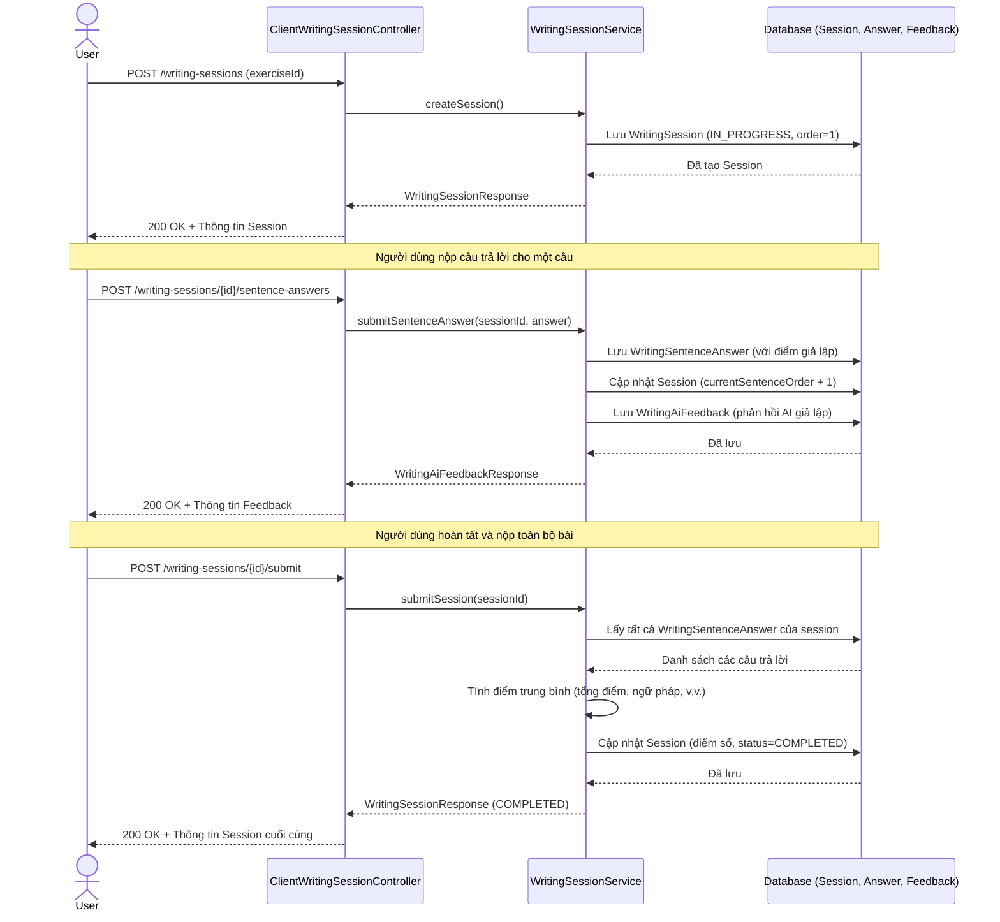

# Tính năng Bài tập Viết & Nhận xét từ AI (Writing Exercise & AI Feedback)

## Tổng quan
Tài liệu này mô tả logic và luồng dữ liệu của tính năng Bài tập Viết và Nhận xét từ AI trong Backend Langora. Tính năng này cho phép người dùng bắt đầu một phiên làm bài viết cho một bài tập cụ thể, nộp đáp án cho từng câu, nhận phản hồi AI theo thời gian thực (hiện tại đang được mock/giả lập), và hoàn thành phiên làm bài để nhận điểm số tổng thể.

## Các Controller và Service tham gia
- **`ClientWritingExerciseController`**: Quản lý việc truy vấn và lấy danh sách các bài tập viết.
- **`ClientWritingSessionController`**: Xử lý vòng đời của một phiên làm bài viết (tạo phiên, nộp câu trả lời, hoàn thành).
- **`WritingSessionService`**: Chứa logic nghiệp vụ cốt lõi để xử lý câu trả lời, giả lập phản hồi từ AI và tính toán điểm số cuối cùng.

## Luồng logic nghiệp vụ
1. **Bắt đầu một phiên làm bài (Start Session)**: Người dùng chọn một bài tập và tạo một `WritingSession` mới. Phiên làm bài bắt đầu với trạng thái `IN_PROGRESS` và `currentSentenceOrder` (thứ tự câu hiện tại) được đặt là 1.
2. **Nộp câu trả lời (Submit Answers)**: 
   - Người dùng có thể nộp câu trả lời từng câu một hoặc nộp hàng loạt (bulk).
   - Đối với mỗi câu được nộp, một bản ghi `WritingSentenceAnswer` sẽ được lưu vào cơ sở dữ liệu.
   - **Xử lý AI (Đang giả lập/Mock)**: Hiện tại, hệ thống gán các điểm số giả lập tĩnh (ví dụ: Ngữ pháp: 8.0, Từ vựng: 9.0) và tạo ra một thực thể `WritingAiFeedback` với nội dung phản hồi giả lập ("Excellent", "Good").
   - `currentSentenceOrder` của phiên làm bài được tăng thêm 1.
3. **Hoàn thành phiên làm bài (Finish Session)**: Khi người dùng nộp toàn bộ phiên làm bài, hệ thống sẽ tổng hợp tất cả điểm số của các `WritingSentenceAnswer`. Nó tính điểm trung bình cho tổng điểm, ngữ pháp, từ vựng, độ trôi chảy và độ chính xác, sau đó cập nhật vào `WritingSession` và đánh dấu trạng thái là `COMPLETED`.

## Sơ đồ tuần tự (Sequence Diagram)

## Các hạn chế hiện tại & Việc cần làm (TODOs)
- **Tích hợp AI**: Hàm `WritingSessionService.submitSentenceAnswer` hiện tại đang sử dụng điểm số và phản hồi giả lập. Phần này cần được thay thế bằng việc tích hợp thực tế với một LLM hoặc dịch vụ AI.
- **Logic tính điểm**: Logic tính trung bình trong hàm `submitSession` đang sử dụng `RoundingMode.HALF_UP` (làm tròn tiêu chuẩn), nhưng cần được kiểm thử với các trường hợp ngoại lệ (edge cases) như khi không có câu trả lời nào được nộp.
